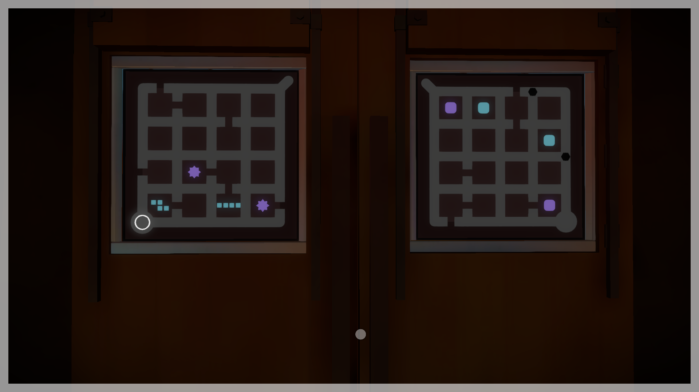
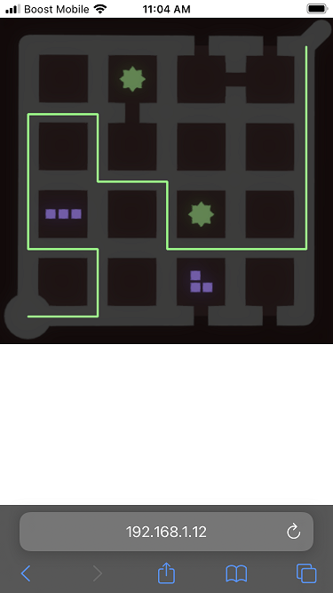
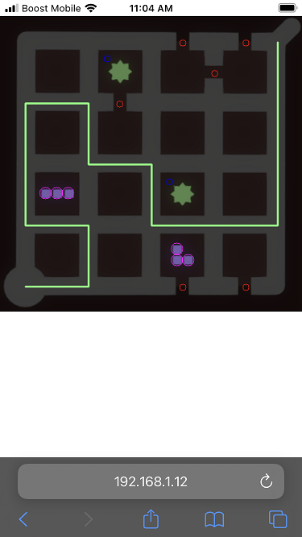

# The-Witness-Puzzle-Solver
Automatically solves the timed puzzle near the end of The Witness (the video game) using the OpenCV computer vision module.

## What it does
When you are near the end of The Witness and you reach the door with two timed puzzles (see image below) this software will automatically calculate the solution. There is currently only support for the puzzle on the left.


## How it works
This software runs a flask web server in the background on the same PC that is running the video game. Use your phone to connect to the web server:


---
Press the button to find the solution:


---
There is also a debug mode that lets you see what elements in the puzzle were found by OpenCV:


---

## Directory structure
#### docs folder
* Documentation used for this readme.
#### sample_screenshots
* Various screenshots of the puzzle which can be used instead of loading up the actual video game. Make sure the screenshots are show full-screen.
#### static folder
* HTML pages used by the flask web server.
#### templates folder
* Images used with OpenCV to detect the relevant objects in the puzzle.
#### (main folder)
 * Main.py
     * Main entry point of the code that starts the web server.
 * PuzzleSolver.py
     * Logic used to solve the puzzle.
 * Vertex.py
     * Helper functions.

## Installation
```bash
pip install flask
pip install opencv-python
```

## Running the software
`python .\Main.py`

## TODO list
Add support for more than one puzzle!
